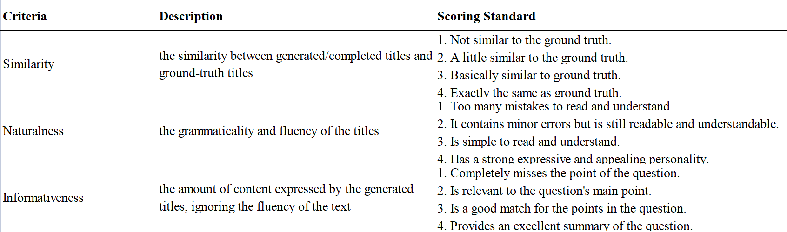
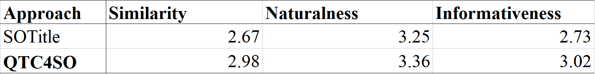

# QTC4SO: Automatic Question Title Completion for Stack Overflow

## Introduction

## Corpus
If you want to download our datasets.[Please click here.](https://drive.google.com/drive/folders/1M0gh2h6u4c7K4QmVae5cbhU4XL-W24ZY?usp=share_link) 

## Pre-trained model
Our pre-trained model has been released on hugging face.[Please click here.](https://huggingface.co/QTC4SO/QTC4SO)

## RQ1

## RQ2

## RQ3

## RQ4

## Our demo
we provide a [demo](./model_code/demo.py). 
You can make the model complete a title for you by modifying the `prefix`,`incomplete title`,`problem description` and `code snippet `.

