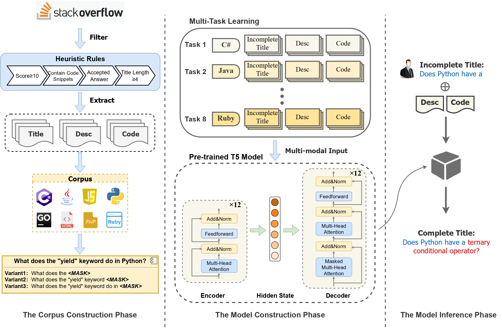
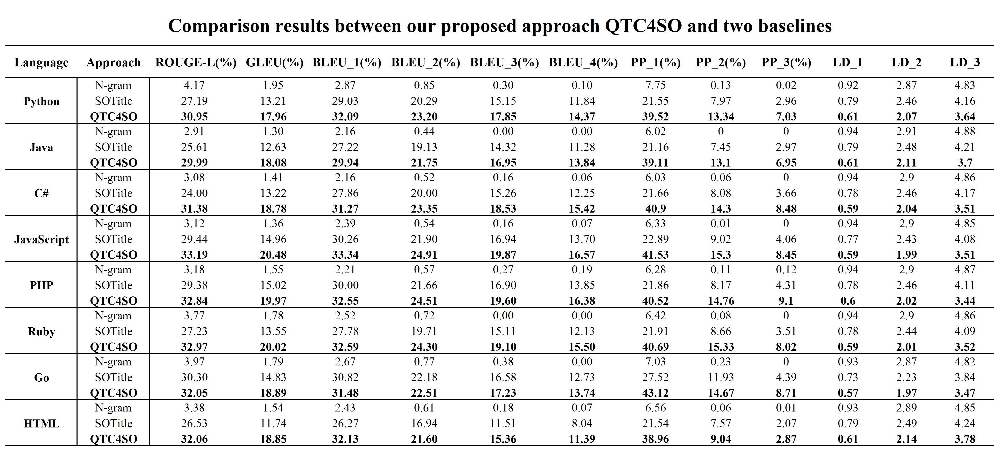
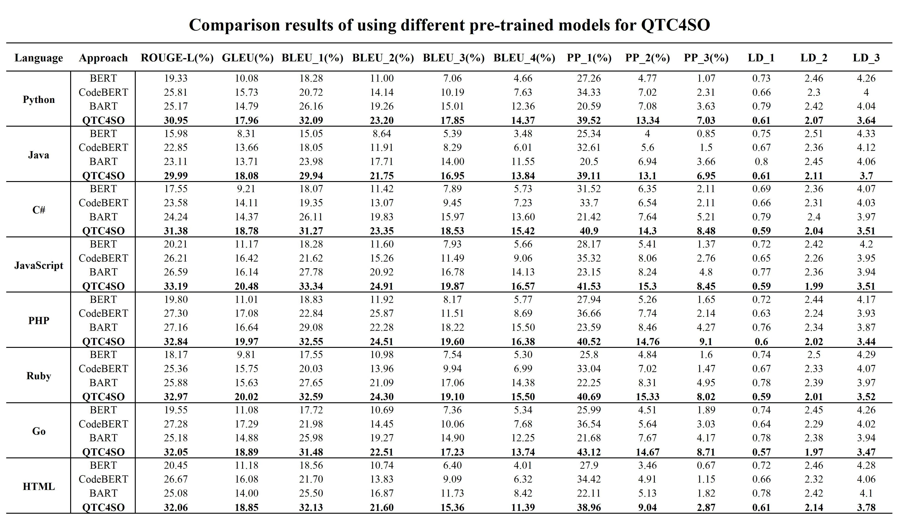
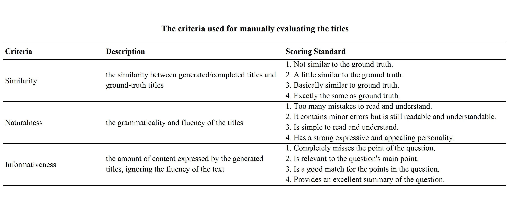
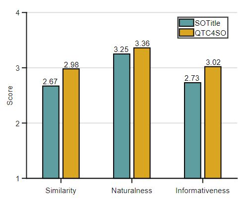
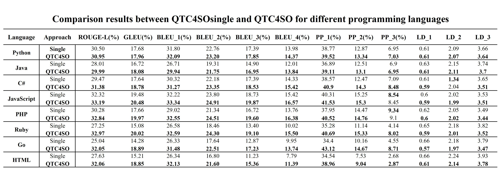

# QTC4SO: Automatic Question Title Completion for Stack Overflow

## Introduction
Framework of our proposed approach of QTC4SO

## Corpus
If you want to download our datasets. [Please click here.](https://drive.google.com/drive/folders/1M0gh2h6u4c7K4QmVae5cbhU4XL-W24ZY?usp=share_link) 

## Model
Our pre-trained model has been released on hugging face. [Please click here.](https://huggingface.co/QTC4SO/QTC4SO)

## RQ1
Motivation: To demonstrate the effectiveness of QTC4SO, we choose five automatic measures to evaluate the quality of question titles generated by QTC4SO and our considered baselines in this RQ.
 

## RQ2
Motivation: In this RQ, we want to conduct ablation experiments by investigating the performance impact of different input modals (i.e.，the problem description and the code snippet) on QTC4SO.
 

## RQ3
Motivation: In this RQ, we want to investigate the performance impact of different pre-trained models on QTC4So. Therefore, we consider the other three popular pre-trained models from the field of natural language processing.
 

## RQ4
Motivation: To effectively evaluate the semantic information in the generated question titles and avoid the weakness of the automatic evaluation measures (e.g., some measures are designed by only considering the lexical overlap between the ground-truth titles and the generated titles), we want to conduct a human study to evaluate the effectiveness of QTC4SO in this RQ.

Here is our Criteria.
 

This figure shows the evaluation results. 
 

## Discussion
In this section,we try to analyze the advantage of multitask learning in QTC4SO. The result shows that multitask learning can improve the performance of QTC4SO.

## Our demo
[Here we provide a demo for using QTC4SO.](./model_code/demo.py) 
The user can utilize our trained model to perform question title completion by modifying the `prefix`, `incomplete title`, `problem description` and `code snippet `.

## Tool
We developed a browser plugin tool based on QTC4So to assist developers in composing questiontitles. The video demonstration of using our tool is available at . 
[https://www.youtube.com/watch?v=4njf4zgDdRs](https://www.youtube.com/watch?v=4njf4zgDdRs)
